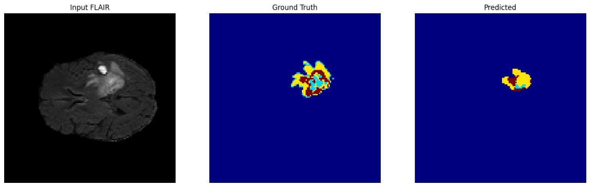
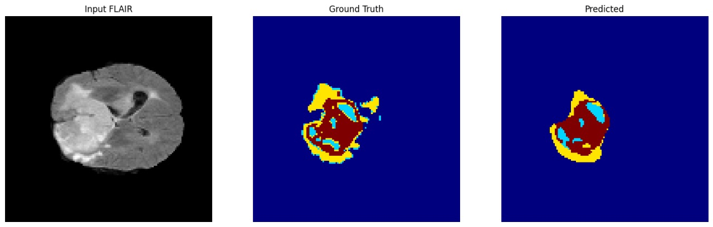
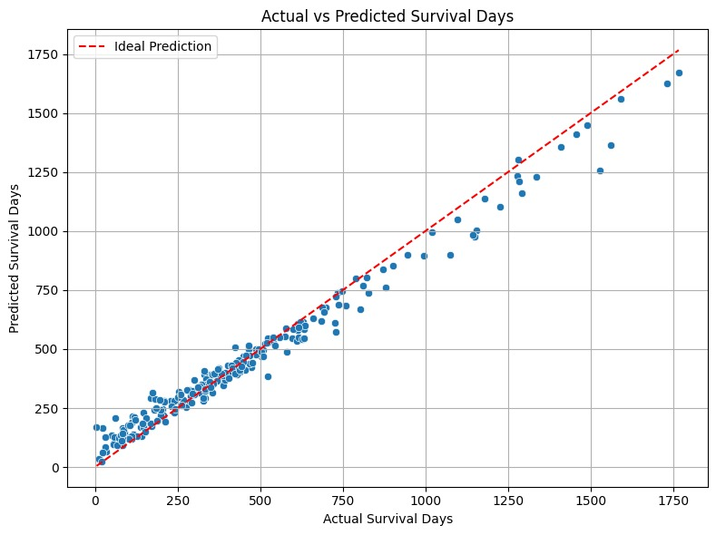

# 🧠 MTC-Net: Multi-Scale Transformer-CNN Network for Brain Tumor Segmentation and Survival Prediction

## 👥 Authors

- **Dheeraj Reddy** (22BCE1257)  
- **Vara Anjan** (22BCE1750)  
- **Jaya Madhav** (22BCE1754)  
- Under the guidance of **Dr. Geeta S**

---

## 🔍 Introduction

Brain tumor segmentation and survival prediction are critical for effective diagnosis and treatment planning, particularly for aggressive gliomas. Traditional CNNs and Transformers have limitations — CNNs miss global context, and Transformers miss fine details. To overcome these, we present **MTC-Net**, a hybrid deep learning architecture that effectively captures both local and global features through **Multi-Scale Transformer Convolution (MTC)** blocks.

---

## 🧠 Project Highlights

- **MTC-Net** combines CNN and Transformer strengths for accurate MRI-based brain tumor segmentation.
- **TCSS (Tumor Classification and Survival System)** improves patient survival time prediction using deep features.
- Developed and tested on the **BraTS 2020** dataset containing 369 MRI scans.

---

## 🛠️ Methodology

### 1. Multi-Scale Feature Extraction
- CNN-based encoder extracts fine tumor details.
- MTC blocks integrate multi-scale features and dynamically handle noisy labels.

### 2. Transformer Integration
- Swin Transformer blocks model long-range dependencies, improving segmentation accuracy.

### 3. MTC-Guided Prediction Refinement
- Dynamically adjusts segmentation predictions using uncertainty maps.
- Refines over-, under-, and phantom-segmentation cases.

### 4. Survival Prediction
- Deep feature-based regression model predicts patient survival days with high accuracy.

---

## 📊 Results

### ✅ Segmentation Results

#### Sample Output 1
Original vs. Predicted Brain Tumor Segmentation

#### Sample Output 2
Original vs. Predicted Brain Tumor Segmentation

---

### 📈 Survival Prediction

#### Scatter Plot
Actual vs. Predicted Survival Days

---

### 📈 Evaluation Metrics

#### For Brain Tumor Segmentation:
- 📊 **Validation Loss**: 0.0392
- 📈 **Validation Accuracy**: 0.9886
- 🎯 **Validation Dice Coefficient** (binary tumor/non-tumor): 0.9764
- 🎯 **Dice Coefficient across all 4 tumor classes**: 0.8631

#### For Survival Prediction:
- ✅ **Mean Absolute Error (MAE)**: 42.42
- ✅ **Mean Squared Error (MSE)**: 3558.98
- ✅ **Root Mean Squared Error (RMSE)**: 59.66
- ✅ **R² Score**: 0.9717
- ✅ **Mean Absolute Percentage Error (MAPE)**: 37.65%
- ✅ **Pearson Correlation (r)**: 0.9916

> These results demonstrate the model's strong ability to generalize well and accurately predict patient outcomes.

---

## 🧪 Dataset

- **BraTS 2020**: Brain Tumor Segmentation Challenge dataset.
- Includes annotated MRI scans (T1, T2, T1CE, FLAIR) and survival labels.

---

## 🚀 Future Work

- Extend MTC-Net to other medical imaging domains.
- Incorporate clinical and genetic biomarkers for better survival prediction.
- Explore uncertainty-aware and generative AI models for more robust medical imaging.

---

## 🏁 Conclusion

MTC-Net establishes a new benchmark in brain tumor segmentation and survival prediction by combining CNNs and Transformers. It achieves high segmentation accuracy, robust survival prediction, and generalizes well across unseen cases — paving the way for smarter AI-driven healthcare solutions.

---

